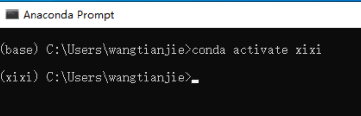

# **目录**
## 1. 项目介绍
## 2. 环境部署
### 2.1 Anaconda安装
### 2.2 求解器安装
### 2.3 python环境复制
## 3.代码使用说明
---
---
---     
    
## 1. 项目介绍
日仪线原油管道能耗优化任务，即在完成原油管道输送任务前提下，寻找费用（消耗能量）最低的沿线设备组合状态。

## 2.环境部署 
本项目电脑系统：windows 10专业版  
处理器：12th Gen Intel(R) Core(TM)  i7-12700  
RAM：16.0 GB  

**！！！安装包在git-lfs中！！！**
### 2.1 Anaconda安装
（1）**安装**  
打开上传文件"Anaconda3-2023.03-1-Windows-x86_64.exe",除了第2步"Install for"选择"All Users",其余一直点击下一步即可。软件默认安装路径为"C:\ProgramData\anaconda3"。  
（2）**添加path路径**  
打开我的电脑，右键"我的电脑"选择"属性"，在弹出窗口右侧选择"高级系统设置"，在弹出窗口选择"环境变量"，再双击"path"，右上角点击新建，输入Anaconda安装路径，操作过程如下图所示。（页面可以不用关，下一步求解器也要添加path路径）  

  
  
 
  

#### 2.2 SCIP求解器安装
（1）**安装**
打开上传文件"SCIPOptSuite-8.0.3-win64-VS15.exe"，一直点击下一步安装即可。默认安装路径为"C:\Program Files\SCIPOptSuite 8.0.3"。  

（2）**添加path路径**  
同上一节，打开"path"，点击"新建",将求解器三个文件夹分别添加至path路径，如下图所示。  
  

### 2.3 python环境复制
（1）将上传文件"xixi.tar.gz"放入Anaconda安装路径下的"envs"文件夹中，将其解压，放入一个文件夹中，如图所示，python环境解压放入了"xixi"文件夹中。  

  

（2）从开始菜单中打开Anaconda终端，输入"conda activate xixi"成功切换环境,如下图所示。

  

## 3.代码使用说明
上一节切换环境后，输入"cd + 代码文件夹路径"按下回车，输入"python Online_calculation_minimize_costs.py"按下回车，代码开始运行。  

   
  
